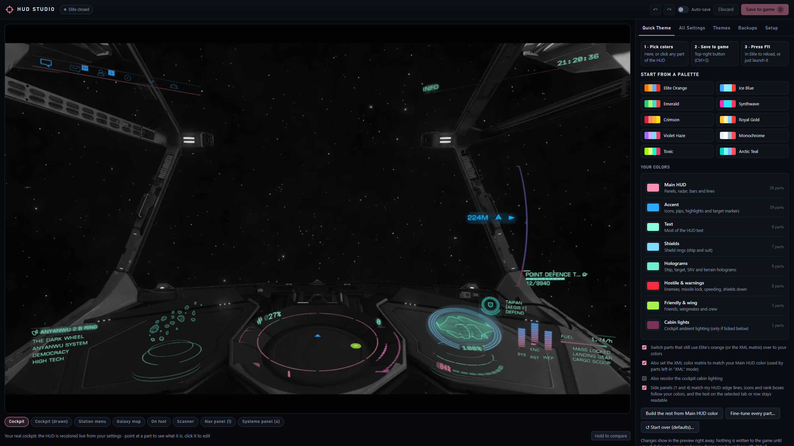
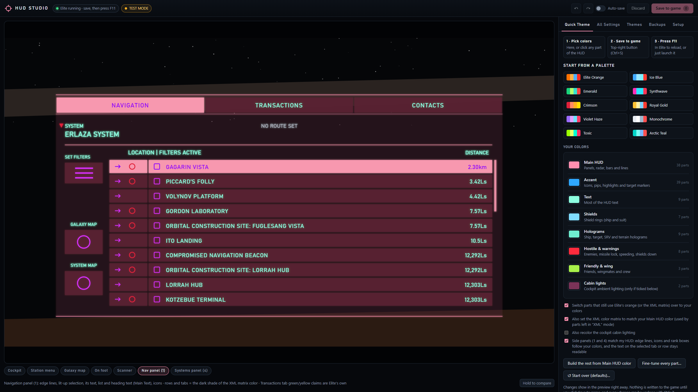
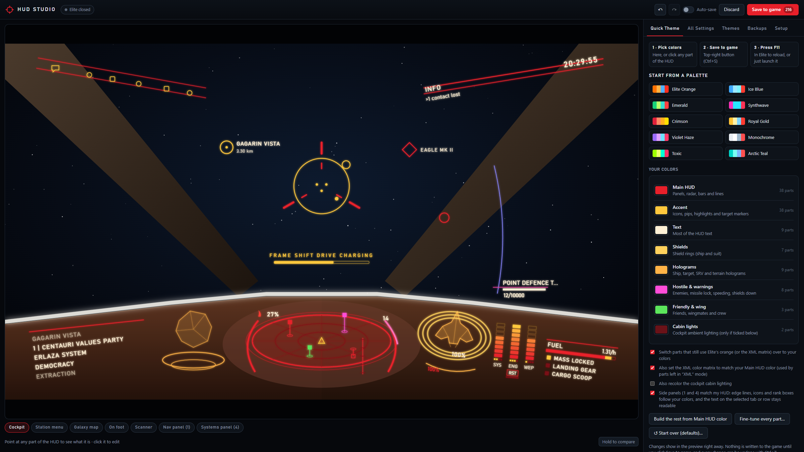

# Elite HUD Studio

**Recolor your Elite Dangerous HUD by clicking on it.** Pick colors, see them on a picture of a real cockpit, click *Save to game*, press F11 in Elite. Done.

Elite HUD Studio is a free, simple color editor for the HUD color files of the [EDHM](https://github.com/psychicEgg/EDHM) mod. It runs on your own PC, nothing is installed, and nothing goes online.

## Contents

- [Download](#download)
- [Quick start](#quick-start)
- [Features](#features)
- [Screenshots](#screenshots)
- [Antivirus warnings](#antivirus-warnings)
- [Requirements](#requirements)
- [Troubleshooting](#troubleshooting)
- [Safety and privacy](#safety-and-privacy)
- [What's in this repository](#whats-in-this-repository)
- [Building the app yourself](#building-the-app-yourself)
- [Contributing](#contributing)
- [Credits](#credits)
- [License](#license)

## Download

Get the latest version from the [Releases](../../releases/latest) page. There are two downloads; they do the same thing.

| Download | What it is | Pick it if |
|---|---|---|
| **Elite-HUD-Studio-v1.6.zip** | The browser version. No `.exe` at all: a web page plus one small script, both plain text you can open and read. | You want the least trouble from antivirus. **Recommended.** |
| **Elite-HUD-Studio-v1.6-app.zip** | The same Studio in its own window (`Elite HUD Studio.exe`). | You prefer a normal app window. |

## Quick start

1. Unzip the folder anywhere (outside Documents is best, for example `C:\Games\Elite HUD Studio`).
2. Double-click **Start HUD Studio.bat** (browser version) or **Start Elite HUD Studio.bat** (app version).
3. The first time, Studio checks it found the right Elite Dangerous folder.
4. Pick your colors: use **Quick Theme** for the fast way, or click any part of the preview to fine-tune it.
5. Click **Save to game** (Ctrl+S), then press **F11** in Elite, or just start the game.

The preview changes instantly. Nothing touches your game until you click Save.

## Features

- **About 390 settings**: radar, reticle, shields, holograms, side panels, station menus, the galaxy map, cockpit lighting, the on-foot suit HUD, and the color matrix that recolors Elite's built-in orange.
- **Click-to-edit previews** of the cockpit, nav panel, systems panel, station menu, galaxy map, scanner and on-foot HUD. Point at a part to see what it is, click it to jump to its color.
- **Quick Theme**: pick about 8 colors and the whole HUD follows, or start from a ready-made palette.
- **Plain names** instead of codes like `x77`.
- **Readability checks** that warn when text will be hard to read.
- **Safe to experiment**: undo/redo, automatic backups before the first save of each session, and a "start over with defaults" button.
- **Themes**: save, load and share your looks. Firefly Grove and Prismatic are included.

## Screenshots

| Nav panel | Drawn cockpit with the Red and Gold theme |
|---|---|
|  |  |

## Antivirus warnings

Elite HUD Studio is new, free and unsigned, so some antivirus programs (Avast, AVG, Malwarebytes and others) flag it with a generic "unknown program" warning. That is a guess based on it being new, not a detection of anything harmful.

- The **browser version** contains no program files, so it is rarely flagged.
- The **app version** does not ask for administrator rights, does not go online, and does not start PowerShell or any other program. It only reads and writes your HUD color files.
- All of the source code is in this repository, including the code for the `.exe` (`app/launcher`). You can read it or build it yourself.

If your antivirus blocks it: add the Studio folder as an exception, restore anything it moved to quarantine, and keep the folder outside Documents if your antivirus protects that folder.

## Requirements

- Windows 10 or 11
- Elite Dangerous (Odyssey / live). Steam, Epic and Frontier-launcher installs are found automatically; anything else can be picked by hand.
- The [EDHM](https://github.com/psychicEgg/EDHM) HUD mod installed in the game. Studio edits its color files and does not install the mod itself.
- App version only: the Microsoft Edge WebView2 Runtime (already part of Windows 11 and most Windows 10 PCs).

## Troubleshooting

| Problem | What to do |
|---|---|
| Studio closes by itself, or files vanish from the folder | Antivirus. See [Antivirus warnings](#antivirus-warnings). |
| "Color files not found" at the top | The HUD mod isn't installed in the game folder Studio is using. Check the folder on the Setup tab. |
| Colors don't change in the game | Press F11 in Elite after saving, or restart the game. |
| "You don't have permission" when saving | Your antivirus is protecting the folder, or the game folder needs administrator rights. Move Studio outside Documents, or run it as administrator once. |
| The app version won't start | Run **Start Elite HUD Studio.bat**: it says why in red and opens the Logs folder. Or use the browser version. |

Still stuck? [Open an issue](../../issues/new/choose) and attach the report from the Setup tab ("Save a diagnostic report").

## Safety and privacy

- Studio only runs on your own PC (`http://localhost:47810`). Nothing is sent online.
- It backs up your color files before the first save of each session; the Backups tab can put them back.
- Don't run another HUD color tool at the same time: both would write the same files.

## What's in this repository

| Path | What it is |
|---|---|
| `HUD Studio.html` | The editor page: the whole user interface |
| `app/server.ps1` | The helper for the browser version (reads and writes the color files) |
| `app/launcher/` | Source of `Elite HUD Studio.exe`: the window (`StudioApp.cs`) and the built-in helper (`Helper.cs`) |
| `app/catalog.json`, `app/defaults.json` | Setting names and default values |
| `app/img/` | The cockpit pictures used by the preview |
| `My Themes/` | The bundled themes |
| `Start HUD Studio.bat` | Starts the browser version |
| `Start Elite HUD Studio.bat` | Starts the app version and checks that it really started |
| `docs/images/` | Screenshots for this page |

## Building the app yourself

The `.exe` is built with the C# compiler that ships with Windows; nothing needs installing.

1. Put Microsoft's WebView2 files (`Microsoft.Web.WebView2.Core.dll`, `Microsoft.Web.WebView2.WinForms.dll`, `WebView2Loader.dll`, from the `Microsoft.Web.WebView2` NuGet package, version 1.0.4258.31 or newer) in `app/webview2/`.
2. Run `powershell -ExecutionPolicy Bypass -File app\launcher\build.ps1`.

## Contributing

Bug reports, theme ideas and fixes are welcome. See [CONTRIBUTING.md](CONTRIBUTING.md). Changes are listed in [CHANGELOG.md](CHANGELOG.md).

## Credits

- [EDHM](https://github.com/psychicEgg/EDHM), the Elite Dangerous HUD Mod, which makes recoloring the HUD possible. Studio only edits its color files.
- [EDHM-UI](https://github.com/BlueMystical/EDHM_UI) by BlueMystical (GPL-3.0). The names and descriptions of the settings in `app/catalog.json` are based on its theme data.
- App window: Microsoft Edge WebView2 (Microsoft, BSD-style license; see `app/webview2/WebView2-LICENSE.txt`).
- Elite Dangerous is a trademark of Frontier Developments. This is a fan-made tool and is not affiliated with or endorsed by Frontier.

## License

[GPL-3.0](LICENSE). You are free to use, share and change it, as long as versions you share stay under the same license.
